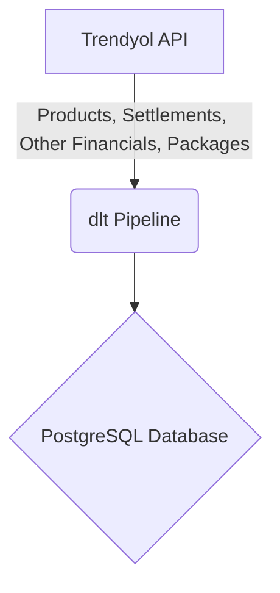

# Trendyol dlt Pipeline

This dlt pipeline extracts data from the Trendyol API and loads it into a PostgreSQL database.

## ELT Process

The following diagram illustrates the ELT process:



## Getting Started

To use this pipeline, you will need to provide your Trendyol API credentials in a `secrets.toml` file.

### 1. Create a `secrets.toml` file

Create a file named `secrets.toml` in the `.dlt` directory of your project. The file should have the following format:

```toml
[sources.trendyol]
token = "YOUR_API_TOKEN"
seller_id = "YOUR_SELLER_ID"
```

Replace `YOUR_API_TOKEN` and `YOUR_SELLER_ID` with your actual Trendyol API token and seller ID.

### 2. Run the pipeline

To run the pipeline, execute the following command:

```bash
python trendyol_dlt.py
```

The pipeline will extract data from the Trendyol API and load it into a PostgreSQL database named `raw_trendyol`.

## Data Model

The data model for the pipeline is defined in the `schemas` directory. The `trendyol.schema.yaml` file contains the schema for the data that is loaded into the database.
